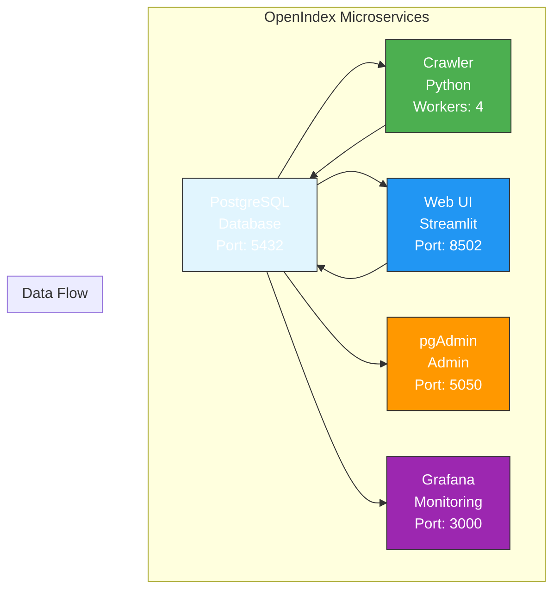

# OpenIndex Stack - Architecture Microservices

## 🏗️ **Architecture**



### 📊 **Services Connectivity**

| Service | Container | Port | Description |
|----------|-----------|------|-------------|
| PostgreSQL | openindex-postgres | 5432 | Base de données principale |
| Crawler | openindex-crawler | - | Service d'indexation |
| Web UI | openindex-web | 8502 | Interface utilisateur |
| pgAdmin | openindex-pgadmin | 5050 | Administration BDD |
| Grafana | openindex-grafana | 3000 | Monitoring dashboards |

## 🐳 **Services**

### 📊 **PostgreSQL (Base de données)**
- **Image** : `postgres:17-alpine`
- **Rôle** : Base de données principale
- **Volumes** : Données persistantes + scripts d'init
- **Healthcheck** : Vérification de disponibilité

### 🔍 **Crawler (Microservice Python)**
- **Dockerfile** : `Dockerfile.crawler`
- **Rôle** : Indexation SMB avec PostgreSQL
- **Workers** : Multi-threading avec queues séparées
- **Configuration** : Variables d'environnement complètes

### 🌐 **Web UI (Microservice Web)**
- **Dockerfile** : `Dockerfile.web`
- **Rôle** : Interface Streamlit autonome
- **Accès** : Interface web moderne
- **Monitoring** : Healthcheck intégré

### 🔧 **Services Optionnels**
- **pgAdmin** : Administration base de données
- **Grafana** : Monitoring et dashboards

## 🚀 **Déploiement**

### Installation rapide
```bash
# 1. Cloner le projet
git clone <repository>
cd OpenIndex

# 2. Déployer la stack complète
./deploy-stack.sh full

# 3. Accéder aux services
# Web UI: http://localhost:8502
# pgAdmin: http://localhost:5050
# Grafana: http://localhost:3000 (admin/admin123)
```

### Déploiement modulaire
```bash
# Interface web uniquement
./deploy-stack.sh web

# Crawler uniquement
./deploy-stack.sh crawler

# Outils d'admin
./deploy-stack.sh admin
```

## 📁 **Structure des fichiers**

```
OpenIndex/
├── Dockerfile.crawler          # Service Crawler Python
├── Dockerfile.web              # Service Web UI
├── docker-compose.stack.yml   # Stack complète
├── deploy-stack.sh            # Script de déploiement
├── src/
│   ├── smb_crawler_postgresql.py  # Crawler amélioré
│   ├── web_interface_v2.py         # Interface web
│   ├── postgres_adapter.py          # Adaptateur PostgreSQL
│   └── ...                       # Autres modules
├── database/
│   └── init.sql                 # Schema PostgreSQL
├── config/
│   └── admin_credentials.ini     # Configuration
└── .env                        # Variables d'environnement
```

## 🔧 **Configuration**

### Variables d'environnement
```bash
# Base de données
POSTGRES_HOST=postgres
POSTGRES_PORT=5432
POSTGRES_DB=openindex
POSTGRES_USER=openindex_user
POSTGRES_PASSWORD=secure_password

# SMB
SMB_SERVER=172.16.252.34
SMB_SHARE=Public\\SEPM
SMB_DOMAIN=SMIDEN
SMB_USERNAME=adminsmiden
SMB_PASSWORD=secret_password

# Crawler
CRAWLER_WORKERS=4
CRAWLER_DELAY=0.1
LARGE_FILE_THRESHOLD=104857600
DEBUG_MODE=false

# Web UI
STREAMLIT_SERVER_PORT=8502
STREAMLIT_SERVER_ADDRESS=0.0.0.0
```

## 🎯 **Avantages de l'architecture**

### ✅ **Scalabilité**
- Services indépendants
- Scaling horizontal possible
- Isolation des ressources

### 🔄 **Déploiement continu**
- Mises à jour indépendantes
- Rollbacks faciles
- Tests isolés

### 🛡️ **Sécurité**
- Isolation par service
- Variables d'environnement
- Réseau dédié

### 📊 **Monitoring**
- Healthchecks individuels
- Logs centralisés
- Métriques par service

## 🚀 **Utilisation**

### Développement
```bash
# Lancer les services en mode développement
docker-compose -f docker-compose.stack.yml --build up

# Logs en temps réel
docker-compose -f docker-compose.stack.yml logs -f
```

### Production
```bash
# Déploiement production
./deploy-stack.sh full

# Mise à jour d'un service
docker-compose -f docker-compose.stack.yml up -d --build web
```

Cette architecture microservices offre une flexibilité maximale pour le développement, le déploiement et la maintenance d'OpenIndex !
