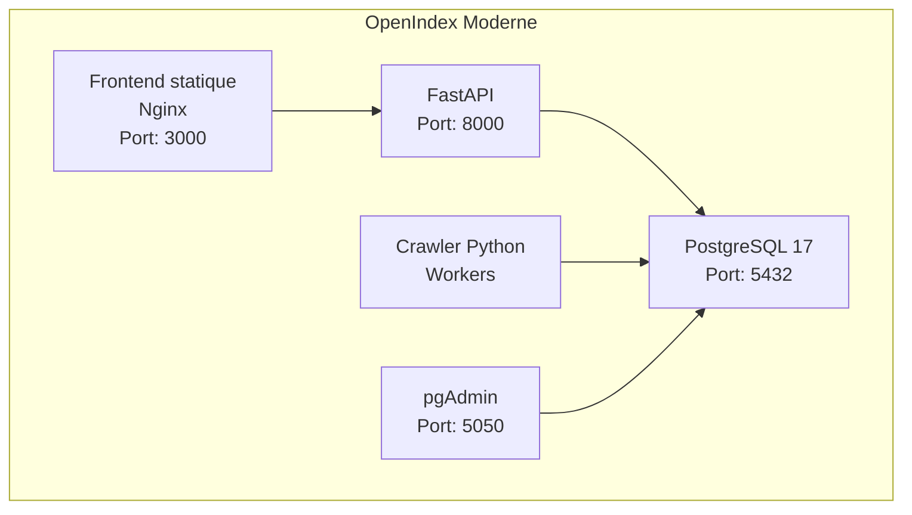

# OpenIndex Stack - Architecture de référence

> Statut : **document de référence actuel** (stack moderne FastAPI + Frontend statique, avec variante J3 en SQLite).
>
> Les éléments basés sur Streamlit / `deploy-stack.sh` / `docker-compose.stack.yml` sont désormais considérés comme **legacy** et ne doivent plus être utilisés pour les nouveaux déploiements.

## 🧭 Clarification de stack

| Domaine | Stack actuelle (à utiliser) | Stack legacy (historique) |
|---|---|---|
| API backend | FastAPI (`src/api/main.py`) | Intégration directe via UI Streamlit |
| Frontend | HTML/JS statique (`frontend/index.html`) servi par Nginx | Streamlit (`src/web_interface_v2.py`) |
| Orchestration | `docker-compose.modern.yml` + `deploy-modern.sh` | `docker-compose.stack.yml` + `deploy-stack.sh` |
| Dockerfiles principaux | `Dockerfile.api`, `Dockerfile.frontend`, `Dockerfile.crawler` | `Dockerfile.web` |
| Documentation de démarrage | `README.md` | anciens guides de stack microservices |

## 🏗️ Architecture actuelle



### Services

| Service | Fichier clé | Port | Rôle |
|---|---|---:|---|
| Frontend | `frontend/index.html` + `nginx/nginx.conf` | 3000 | UI utilisateur |
| API | `src/api/main.py` | 8000 | Endpoints REST + WebSocket |
| Crawler | `src/smb_crawler_postgresql.py` | - | Indexation SMB |
| PostgreSQL | `database/init.sql` | 5432 | Stockage principal |
| pgAdmin (optionnel) | `docker-compose.modern.yml` | 5050 | Administration BDD |

## 🚀 Déploiement recommandé

### Démarrage complet
```bash
./deploy-modern.sh modern
```

### Démarrage par composant
```bash
./deploy-modern.sh api
./deploy-modern.sh frontend
./deploy-modern.sh crawler
```

### Vérification rapide
```bash
./deploy-modern.sh status
```

## 🧹 Nettoyage docs legacy

- Les anciennes références de stack Streamlit doivent rester cantonnées à :
  - `archives/`
  - `Archives/`
- Toute nouvelle documentation technique doit pointer vers :
  - `docker-compose.modern.yml`
  - `deploy-modern.sh`
  - `Dockerfile.api` / `Dockerfile.frontend` / `Dockerfile.crawler`

## 📌 Règle éditoriale

Avant toute mise à jour de documentation, vérifier la cohérence de la stack sur ces trois fichiers :
- `README.md`
- `README.stack.md`
- `ROADMAP.md`

Cela évite la réintroduction de consignes legacy dans le parcours de démarrage.


## 🔁 Variante J3 (SQLite + image GHCR)

La variante J3 est un mode temporaire orienté stabilisation :
- API FastAPI sur SQLite (`OPENINDEX_DB_PATH`) ;
- endpoint `/api/db-explain` pour l'analyse de plans SQL ;
- exécution via `docker-compose.j3.yml` en **image-first** (`OPENINDEX_J3_IMAGE`) ;
- build/push automatique de l'image via `.github/workflows/docker-j3.yml`.

### Lancement J3
```bash
cp .env.example .env
docker compose -f docker-compose.j3.yml pull
docker compose -f docker-compose.j3.yml up -d
```

> La migration vers PostgreSQL reste planifiée en J4.
